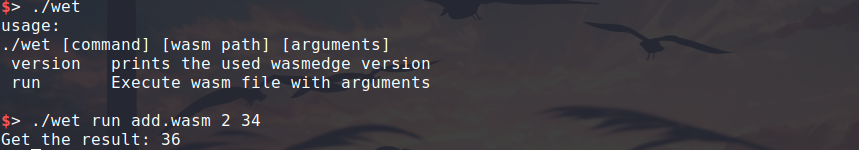

# WASMTOOL
Wasmtool is an implementation to execute *.wasm file functions for [WasmEdge LFX mentorship pretest](https://github.com/WasmEdge/WasmEdge/discussions/2227).


### Create *.wasm from *.wat[ <sub>(1)</sub>](https://developer.mozilla.org/en-US/docs/WebAssembly/Text_format_to_wasm)
```
wat2wasm add.wat -o add.wasm
```

### Build tool (wet)
First you need to install [WasmEdge](https://github.com/WasmEdge/WasmEdge)
```
gcc wet.c -lwasmedge -o wet
```
### Usage

```
./wet [command] [wasm path] [arguments]
version   prints the used wasmedge version
run       Execute wasm file with arguments

examples: 
./wet help
./wet version
./wet run add.wasm 1 1
```

